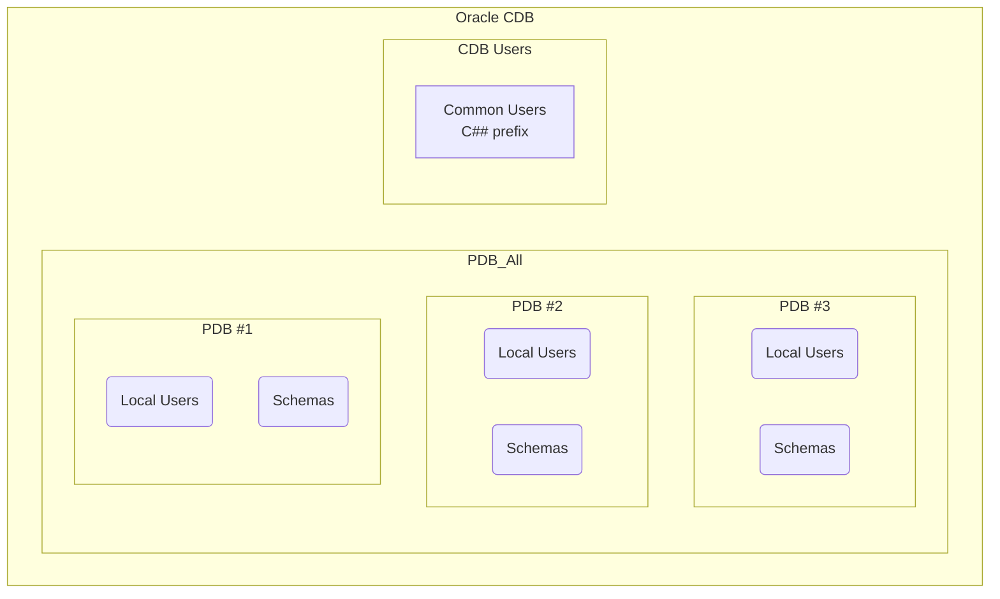

# Oracle Database CDB/PDB/User/Schema Overview

## 1. CDB (Container Database)

* The main database (Container) that stores system metadata and manages multiple PDBs.
* Consists of:

  * **Root Container (CDB\$ROOT)**: Contains system metadata and global information for all PDBs.
  * **PDBs (Pluggable Databases)**: Individual, portable databases plugged into the CDB.
  * **Seed PDB (PDB\$SEED)**: A read-only template used for creating new PDBs.

---

## 2. PDB (Pluggable Database)

* A self-contained database “plugged” into a CDB.
* Has its own schemas, users, tables, and data.
* Example in Oracle XE: `XEPDB1`

---

## 3. Users and Schemas

| Term            | Description                                          |
| --------------- | ---------------------------------------------------- |
| **User**        | Oracle account used for login and schema ownership   |
| **Schema**      | A collection of database objects created by a user   |
| **Common User** | Created at the CDB level, must begin with `C##`      |
| **Local User**  | Created within a specific PDB, can use regular names |

---

## 4. User/Schema Relationship with CDB/PDB

| User Type   | Created In | User/Schema Name      | Usage Scope                                      |
| ----------- | ---------- | --------------------- | ------------------------------------------------ |
| Common User | CDB        | Must start with `C##` | Accessible across multiple PDBs with privileges  |
| Local User  | PDB        | Any valid name        | Accessible only within the PDB it was created in |

---

## 5. Sample SQL Commands for Managing CDB/PDB/User/Schema

#### 5.1 Show current container

```sql
SHOW CON_NAME;
```

#### 5.2 List all PDBs in the CDB

```sql
SELECT con_id, name, open_mode FROM v$pdbs;
```

#### 5.3 Switch to a PDB (e.g., XEPDB1)

```sql
ALTER SESSION SET CONTAINER = XEPDB1;
```

#### 5.4 Create a Common User (in CDB)

```sql
CREATE USER C##ADMIN IDENTIFIED BY password;
GRANT DBA TO C##ADMIN;
```

#### 5.5 Create a Local User (in PDB)

```sql
CREATE USER appuser IDENTIFIED BY password;
GRANT CONNECT, RESOURCE TO appuser;
```

#### 5.6 Create a table under a Local User's schema

```sql
CREATE TABLE employees (
  emp_id NUMBER GENERATED ALWAYS AS IDENTITY PRIMARY KEY,
  emp_name VARCHAR2(100),
  emp_salary NUMBER,
  emp_hiredate DATE DEFAULT SYSDATE
);
```

#### 5.7 List all users/schemas in the PDB

```sql
SELECT username FROM dba_users ORDER BY username;
```

---

## 6. Flow Diagram (Overview)



---

## 7. Additional Recommendations

* Use **Common Users** for DBA-level tasks or access across multiple PDBs.
* Use **Local Users** for regular application development within a single PDB.
* Always switch containers using:

  ```sql
  ALTER SESSION SET CONTAINER = <PDB_NAME>;
  ```

  before executing commands within a specific PDB.
* Explore available PDBs with `v$pdbs`.
* Inspect users/schemas using the `dba_users` view.
